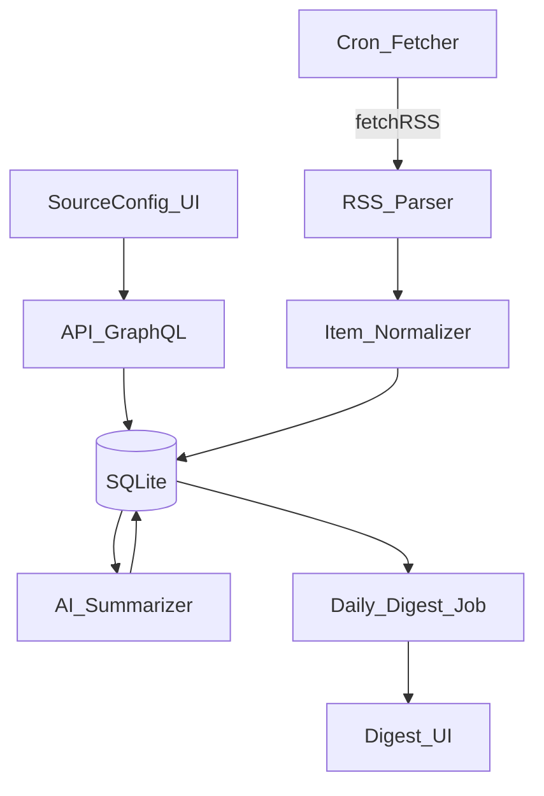

# IT Knowledge Digest Tool (NestJS + Nuxt + SQLite)

## Goals

- Web dashboard to manage content sources (RSS/Atom first) and view incoming items.
- Background ingestion/parsing into SQLite.
- AI-powered summarization + lightweight analysis and a daily digest report.
- Tag/topic grouping and filtering.
- Main purpose: keep IT/dev knowledge up to date (new tools, releases, projects, and techniques) with less reading time.
- Mobile-friendly UX using Nuxt 3 + Vuetify (responsive layouts).

## Proposed stack (modern, JS-centric)

- **Backend**: NestJS (TypeScript), GraphQL API + cron jobs.
- **Frontend**: Nuxt 3 + Vuetify (dashboard, source manager, feeds, digest views).
- **DB**: SQLite (local file) with a TypeScript ORM.
- **Queue/scheduler**: in-process cron to start; optional job queue later.
- **AI**: OpenAI-compatible API for summaries/analysis (pluggable provider).
- **Local run**: Docker Compose (app + optional mail relay later).
- **Package manager**: pnpm.

## Repo layout (new, since repo is currently empty)

- [`apps/api`](apps/api) NestJS service
- [`apps/web`](apps/web) Nuxt 3 dashboard
- [`packages/shared`](packages/shared) shared types/schemas (optional but recommended)

## Data model (SQLite)

Core tables:

- **sources**: id, name, type (rss), url, enabled, fetchIntervalMinutes, lastFetchedAt, createdAt
- **items**: id, sourceId, url, title, author, publishedAt, contentText, contentHtml, language, hash, createdAt
- **tags**: id, name
- **item_tags**: itemId, tagId
- **topics**: id, name, prompt (topic definition)
- **item_topics**: itemId, topicId, score
- **summaries**: id, itemId, model, summary, keyPointsJson, sentiment, createdAt
- **digests**: id, date, title, summary, sectionsJson (by topic/tag), createdAt

Key constraints:

- Unique `(sourceId, url)` or `(sourceId, hash)` to dedupe.

## MVP source (day 1)

- Start with a single RSS feed: `https://dev.to/feed/`
- The system should support adding more RSS feeds via the dashboard without code changes.

## Ingestion + processing flow

## GraphQL API surface (initial)

Queries:

- `sources`
- `items(filters)`
- `item(id)`
- `digests`
- `digest(date)`

Mutations:

- `createSource`, `updateSource`, `deleteSource`, `toggleSourceEnabled`
- `fetchSourceNow(sourceId)`
- `summarizeItem(itemId)`
- `assignTags(itemId, tags)`
- `upsertTopic(name, prompt)`
- `runDailyDigest(date)` (admin/manual)

Optional (later):

- Subscriptions: `itemIngested`, `digestCreated`

## Mobile-friendly UI requirements

- Use responsive Vuetify layouts and components (no desktop-only assumptions).
- Core flows must work well on small screens: sources CRUD, item triage, digest reading.
- Prefer a two-step flow on mobile: list → detail, with fast back navigation.

## UI pages (Nuxt)

- **Sources**: list/create/edit, enable/disable, manual fetch, last fetch status.
- **Inbox/Items**: stream of items with filters (source, tag/topic, date), quick preview.
- **Item detail**: original link, extracted text, AI summary, tag/topic assignment.
- **Daily digest**: today + history, grouped sections by topic/tag.
- **Settings**: AI provider key, digest time, defaults.

## Incremental delivery plan

- **Phase 0 (foundation)**: pnpm workspace, NestJS + Nuxt bootstrapped, Docker Compose, env management.
- **Phase 1 (GraphQL + sources + RSS ingestion)**: GraphQL schema/resolvers, sources CRUD, RSS fetch + parse, dedupe, store items, UI to view items.
- **Phase 2 (tags/topics)**: tagging UI + API, topic definitions, basic topic scoring (keyword rules first).
- **Phase 3 (AI summaries)**: provider abstraction, per-item summarization, caching, UI rendering.
- **Phase 4 (daily digest)**: scheduled job to build digest, digest UI page; optional delivery (Telegram) as a follow-up.

## Security & ops (MVP)

- Single-user local deployment: simple password auth or local-only binding in first cut.
- Secrets via `.env` (AI key), not committed.
- Backups: copy SQLite DB file (documented via runtime command later).

## Key files/modules we’ll create

- API: [`apps/api/src/modules/sources`](apps/api/src/modules/sources), [`apps/api/src/modules/items`](apps/api/src/modules/items), [`apps/api/src/modules/digest`](apps/api/src/modules/digest)

